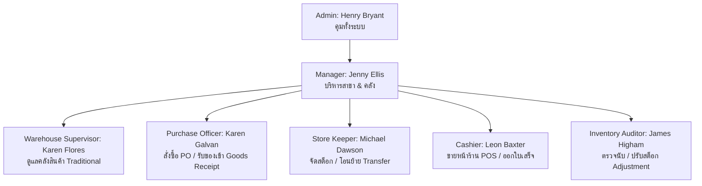

# 👥 ตารางข้อมูลผู้ใช้งานระบบ (System Users & Role Directory)

เอกสารนี้รวบรวมข้อมูลบัญชีผู้ใช้งานจำลอง (Seed Data), สิทธิ์การเข้าถึง (Roles & Permissions), และการผูกความสัมพันธ์กับ **Warehouse (คลังสินค้า)** และ **Store (สาขาหน้าร้าน)** ในระบบ ABCPOS

---

## 📋 1. ตารางรายชื่อผู้ใช้งานระบบ (System Users Table)

| ID | ชื่อ-นามสกุล (Name) | บทบาท (Role) | คลังที่สังกัด (Warehouse) | สาขาที่สังกัด (Store) | อีเมล (Email) | เบอร์โทร (Phone) | สถานะ (Status) |
| :---: | :--- | :--- | :--- | :--- | :--- | :--- | :---: |
| `1` | **Henry Bryant** | **`Admin`** *(ผู้ดูแลระบบ)* | Lavish Warehouse | ElectroMart Main | `henry@example.com` | `+12498345785` | <span style="color:green;font-weight:bold;">ACTIVE</span> |
| `2` | **Jenny Ellis** | **`Manager`** *(ผู้จัดการสาขา)* | Traditional Warehouse | Apex Branch | `jenny@example.com` | `+13178964582` | <span style="color:green;font-weight:bold;">ACTIVE</span> |
| `3` | **Michael Dawson** | **`Store Keeper`** *(เจ้าหน้าที่คุมคลัง)* | **Lavish Warehouse** | ElectroMart Main | `michael@example.com` | `+13798132475` | <span style="color:green;font-weight:bold;">ACTIVE</span> |
| `4` | **Karen Flores** | **`Warehouse Supervisor`** *(หัวหน้าคลัง)* | **Traditional Warehouse** | Apex Branch | `karen@example.com` | `+17538647943` | <span style="color:green;font-weight:bold;">ACTIVE</span> |
| `5` | **Leon Baxter** | **`Cashier`** *(แคชเชียร์หน้าร้าน)* | Lavish Warehouse | **ElectroMart Main** | `leon@example.com` | `+12796183487` | <span style="color:green;font-weight:bold;">ACTIVE</span> |
| `6` | **Karen Galvan** | **`Purchase Officer`** *(เจ้าหน้าที่จัดซื้อ)* | **Lavish Warehouse** | ElectroMart Main | `galvan@example.com` | `+17596341894` | <span style="color:green;font-weight:bold;">ACTIVE</span> |
| `7` | **Thomas Ward** | **`Delivery Biker`** *(พนักงานจัดส่ง)* | Traditional Warehouse | Apex Branch | `thomas@example.com` | `+12973548678` | <span style="color:green;font-weight:bold;">ACTIVE</span> |
| `8` | **James Higham** | **`Inventory Auditor`** *(ผู้ตรวจสอบสต็อก)* | Lavish Warehouse | Apex Branch | `james@example.com` | `+11978348626` | <span style="color:green;font-weight:bold;">ACTIVE</span> |
| `9` | **Jada Robinson** | **`Accountant`** *(เจ้าหน้าที่บัญชี)* | Lavish Warehouse | ElectroMart Main | `robinson@example.com` | `+12678934561` | <span style="color:green;font-weight:bold;">ACTIVE</span> |
| `10` | **Aliza Duncan** | **`Maintenance`** *(ฝ่ายดูแลบำรุงรักษา)* | Traditional Warehouse | ElectroMart Main | `aliza@example.com` | `+13147858357` | <span style="color:green;font-weight:bold;">ACTIVE</span> |

---

## 🛡️ 2. หน้าที่และความรับผิดชอบตามบทบาท (Roles & Responsibilities)



### รายละเอียดการปฏิบัติงานของแต่ละตำแหน่ง:
1. **`Admin` (ผู้ดูแลระบบ)**: เข้าถึงทุกโมดูล จัดการผู้ใช้ ตั้งค่าระบบ กำหนดบทบาท และดูรายงานระดับบริหาร
2. **`Store Keeper` & `Warehouse Supervisor` (เจ้าหน้าที่และหัวหน้าคลัง)**: 
   - รับผิดชอบหน้า **`/stock/manage`**, **`/stock/adjustment`**, **`/stock/transfer`**
   - รับสินค้าเข้าคลังเมื่อมีใบ PO ส่งมาถึง (Goods Receipt `RECEIVED`)
3. **`Purchase Officer` (ฝ่ายจัดซื้อ)**:
   - รับผิดชอบหน้า **`/purchases`**, **`/purchases/orders`**, **`/purchases/returns`**
   - ออกใบสั่งซื้อ PO ถึงซัพพลายเออร์ และตรวจรับสินค้าเข้าสต็อก
4. **`Cashier` & `Salesman` (แคชเชียร์และพนักงานขายหน้าร้าน)**:
   - รับผิดชอบหน้า **`/pos`** (POS Terminal) และ **`/sales`**
   - ยิงบาร์โค้ดขายสินค้า รับชำระเงินสด/QR/บัตร และตัดสต็อกอัตโนมัติ
5. **`Inventory Auditor` (ผู้ตรวจสอบสต็อก)**:
   - ตรวจสอบยอดสต็อกคงเหลือจริงเปรียบเทียบกับระบบที่ **`/inventory/low-stock`**, **`/reports/inventory`**
   - บันทึกการปรับปรุงยอดสต็อกเกิน/ขาด (`Adjustment + / -`)

---

## 🗄️ 3. โครงสร้าง Database Schema (`SystemUser`)

```prisma
model SystemUser {
  id            String   @id @default(uuid())
  name          String
  phone         String?
  email         String   @unique
  role          String   @default("Admin")
  warehouseName String?  // e.g. "Lavish Warehouse"
  storeName     String?  // e.g. "ElectroMart Main"
  avatar        String?  @default("/assets/images/customer11.jpg")
  status        String   @default("ACTIVE") // ACTIVE, INACTIVE
  password      String?
  createdAt     DateTime @default(now())
  updatedAt     DateTime @updatedAt
}
```

---

## 🔌 4. รายการ API Endpoints (`/api/users`)

| Method | Endpoint | Description | Query Parameters |
| :--- | :--- | :--- | :--- |
| **`GET`** | `/api/users` | ดึงรายชื่อผู้ใช้งานทั้งหมด | `?status=ACTIVE&role=Admin&warehouse=Lavish&search=Henry` |
| **`GET`** | `/api/users/:id` | ดึงข้อมูลผู้ใช้งานรายบุคคล | - |
| **`POST`** | `/api/users` | สร้างบัญชีผู้ใช้งานใหม่ | Body: `{ name, email, phone, role, warehouseName, storeName, avatar, status, password }` |
| **`PUT`** | `/api/users/:id` | แก้ไขข้อมูลผู้ใช้งาน | Body: `{ name, email, phone, role, warehouseName, storeName, avatar, status }` |
| **`DELETE`** | `/api/users/:id` | ลบบัญชีผู้ใช้งาน | - |

---

## 🎨 5. มาตรฐาน UI / UX ตามกฎ `GEMINI.md`
- **Dropdowns**: ใช้ `SearchableSelect` สำหรับตัวเลือก Role, Warehouse, Store, Status ทั้งหมด
- **Action Buttons**: เรียงลำดับเสมอ **View (`Eye`)** $\rightarrow$ **Edit (`Edit`)** $\rightarrow$ **Delete (`Trash2`)**
- **Feedback Modals**:
  - `Add Success`: ไอคอนประกายสีเขียว (`Sparkles`) พร้อมปุ่ม `+ Add Another` และ `Done`
  - `Edit Success`: ไอคอนติ๊กถูกสีฟ้า (`CheckCircle2`) พร้อมปุ่ม `OK`
  - `Delete Flow`: Step 1 ถามยืนยัน (`Trash2` สีแดง Rose) $\rightarrow$ Step 2 สำเร็จ (`Trash2` สีเหลือง Amber)
  - `Error Modal`: ไอคอนเตือนสีแดง (`AlertTriangle`) พร้อมปุ่ม `OK`
- **Exporting**: รองรับทั้ง **PDF (`window.print()`)** และ **CSV Export**
